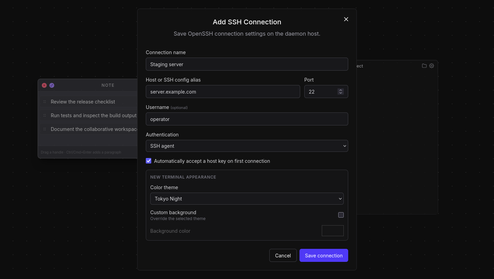
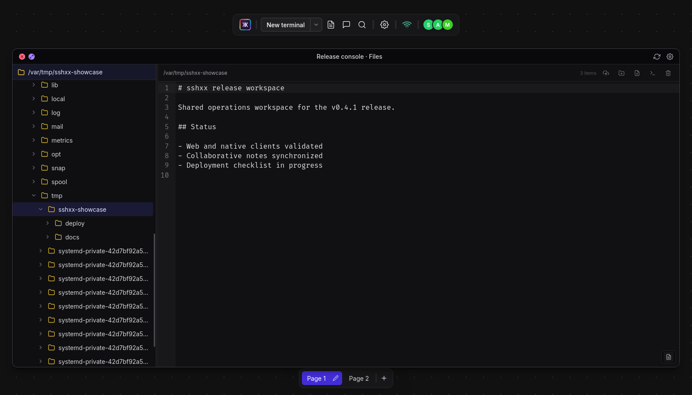

# sshxx

[English](README.md) | [简体中文](README.zh-CN.md)

sshxx is a self-hosted, persistent, collaborative terminal with browser and
cross-platform app viewers. Terminal processes are owned by a daemon rather than
by the browser, so closing or refreshing a viewer does not end the shell.

This project is derived from [sshx](https://github.com/ekzhang/sshx), created by
[Eric Zhang](https://github.com/ekzhang). Thank you to Eric and every upstream
contributor for the original architecture and implementation. sshxx keeps that
foundation while adding features and interaction changes for a different set of
personal workflows.


## Upstream relationship

sshxx is published as an independent repository rather than a GitHub fork, so
GitHub may not display a “forked from” badge. The repository retains the
upstream Git history and MIT license. Add the original project as an `upstream`
remote when suitable upstream changes need to be reviewed or merged:

```shell
git remote add upstream https://github.com/ekzhang/sshx.git
```

## What changed

- Browser and Tauri-based desktop/mobile viewers share one Svelte frontend.
- The daemon persists pages, terminal layout, appearance, and notes in the
  current working directory.
- Multiple independent canvas pages, page-aware global search, editable notes,
  terminal duplication, eight-direction resizing, and optional grid snapping.
- Per-terminal color themes, background overrides, opacity and title controls;
  notes use a distinct neutral palette and retain independent appearance.
- Light, dark, and system-following application modes without changing terminal
  or note palettes.
- A split terminal launcher with daemon-persisted OpenSSH connection profiles
  for default/config, agent, private-key, and interactive password workflows.
- Character-level note synchronization, page-aware collaboration events, and
  links between notes, terminals, and file editors.
- A synchronized canvas file explorer with a folder tree, directory grid,
  CodeMirror editor, upload/create/rename/move/delete actions, and “open
  terminal here”. Local and key/agent-based SSH terminals are supported.
- Local terminals accept pasted or dropped images, transfer them with end-to-end
  encryption into the daemon's `cache/uploads/`, and insert the absolute path.
- Browser-local page/view restoration is kept separate from synchronized
  workspace data, while the toolbar connection indicator reports session state.
- Updated terminal rendering and frontend/backend dependencies.
- Product binaries are named `sshxx-daemon`, `sshxx-server`, and `sshxx-client`
  to distinguish them from upstream sshx.

## Feature tour

### Reusable SSH connections

Connection profiles are configured from the terminal split button and stored in
authenticated encrypted form by the daemon. Each profile can define its default
terminal theme and optional background override.



### Structured, connected notes

Notes use visible paragraphs with drag handles. A paragraph can be copied by
dragging, or sent to linked notes, terminals, executing terminals, and open file
editors. Focusing a note highlights its linked canvas items without changing
their saved appearance.


### Files beside terminals

The file explorer is a first-class synchronized canvas window rather than a
modal. It combines a resizable folder tree with directory browsing, previews,
and a syntax-aware text editor.



The versioned source for the detailed feature guide is in
[`docs/wiki`](docs/wiki/Home.md). It is ready to publish to the repository's
GitHub Wiki after the first Wiki page initializes the separate Wiki Git
repository.

## Architecture

| Component      | Source               | Responsibility                                        |
| -------------- | -------------------- | ----------------------------------------------------- |
| `sshxx-daemon` | `crates/sshx-daemon` | Owns shell processes and local workspace persistence. |
| `sshxx-server` | `crates/sshx-server` | Coordinates sessions and serves the Web client/API.   |
| `sshxx-client` | `src/`, `src-tauri/` | Displays sessions in a browser or packaged app.       |

The server coordinates encrypted terminal data but does not own the shell
process. The daemon continues running terminals when all viewers disconnect.

## State, synchronization, and security boundaries

sshxx keeps shared workspace state separate from each viewer's local UI state.
The following table is the compatibility contract for feature development:

| Data                                                                                 | Persistence owner                                                                | Synchronization scope                                                                          |
| ------------------------------------------------------------------------------------ | -------------------------------------------------------------------------------- | ---------------------------------------------------------------------------------------------- |
| Pages, canvas windows, layout/appearance, notes/links, and file-browser/editor state | Daemon `.sshx-workspace`                                                         | Same session, with a page ID on every canvas mutation                                          |
| Shell/SSH processes                                                                  | Daemon memory                                                                    | Terminal stream/input is shared; processes survive viewer disconnects, not daemon restarts     |
| Reusable SSH profiles                                                                | Daemon `.sshx-connections`, authenticated-encrypted with `.sshx-connections.key` | Profile metadata is visible in the session; only writers can modify it                         |
| Actual files and directories                                                         | Daemon or SSH target filesystem                                                  | Operations use the daemon OS account or SSH account; the related browser state is shared       |
| Active page and per-page pan/zoom                                                    | Browser `localStorage`, scoped by server/session                                 | Local to one browser profile; never synchronized                                               |
| User settings                                                                        | Browser `localStorage`                                                           | Local to one browser profile; never daemon-persisted                                           |
| Focus, full-screen, menus, drag/link selection, undo/redo                            | Browser memory                                                                   | Local and temporary                                                                            |
| Users, cursors, focus presence, note editing ownership                               | Server memory                                                                    | Transient within the session; not daemon-persisted                                             |
| Pasted images                                                                        | Daemon `cache/uploads/`                                                          | Completed files are local plaintext with owner-only permissions and startup expiry cleanup     |
| Session continuity snapshot                                                          | Server memory and optional Redis                                                 | Short-lived failover data (20-second sync, 5-minute expiry), not a durable workspace or backup |

Page switching is intentionally local. Shared mutations always retain their page
identity, preventing an action on page A from being applied to page B. Global
search runs locally over the received all-page snapshot; its query and
navigation are not synchronized.

Viewer/server traffic should use HTTPS/WSS outside localhost or a trusted,
isolated LAN. The URL fragment contains bearer session/write secrets: it is not
sent as part of an HTTP request, but can still be exposed through browser
history, screenshots, extensions, or accidental sharing. Terminal streams,
filesystem request/response bodies, image chunks, and active editor contents are
session-key encrypted through the server. Coordination metadata—including
page/layout state, note text, display names, titles, filesystem paths, and SSH
profile host/user/key-path fields—is server-visible and may appear in optional
Redis snapshots.

A write-capable participant is trusted to use the daemon or SSH account's
terminal and filesystem permissions; sshxx is not a filesystem sandbox. The
server enforces write access and page/object validation, but write URLs should
only be shared with users who may exercise those account privileges. The full
data-visibility matrix, communication links, Redis lifetime, local filenames,
and rules for future stateful features are documented in
[`Architecture-and-State.md`](docs/wiki/Architecture-and-State.md).

## Development

The repository follows its lockfiles and is intended to use the runtimes managed
by `mise`. Install the declared JavaScript dependencies and start the
development Redis service:

```shell
mise install
npm ci
docker compose up -d
```

Run the server, daemon, and Web viewer together:

```shell
mprocs
```

The default development session is available at:

```text
http://localhost:5173/s/dev#localdevkey
```

The daemon stores workspace metadata in `.sshx-workspace` in its current
directory. This compatibility filename is intentionally retained from sshx so
existing workspaces continue to load. Start the daemon from the same directory
to restore the saved pages, notes, layout, and terminal configuration. Shell
processes themselves are recreated. Unreadable or future-format workspaces are
preserved with an `.invalid-*` suffix before a clean workspace is created.

Reusable SSH connection profiles are stored beside the workspace as an
authenticated encrypted `.sshx-connections` file. Its local key is created with
owner-only permissions in `.sshx-connections.key`. Password authentication
always prompts inside OpenSSH and never stores the password. Unreadable or
future-format files are preserved with an `.invalid-*` suffix so they cannot
prevent the daemon from starting.

## Canvas and terminal controls

- Drag empty canvas space to pan. Middle-button drag always pans the canvas,
  including while the pointer is over a terminal or note.
- `Ctrl` + wheel always zooms the canvas and overrides browser zoom. Plain wheel
  scrolls a hovered terminal or note regardless of focus; outside windows it
  zooms when no terminal or note is active. Scrollable menus also retain their
  normal scrolling behavior.
- With grid snapping enabled, moving and resizing align window edges to visible
  grid points with a small, consistent inset. New windows use the same grid.
- Click a note to edit it; press `Escape` or click outside to leave editing.
- `Ctrl`/`Cmd` + `Enter` creates a new note paragraph; plain Enter inserts a
  line break inside the current paragraph. Paragraph handles expose send and
  delete actions and can be dragged to compatible canvas targets.
- When terminal text is selected, `Ctrl+C` copies and clears the selection.
  Otherwise it is sent to the shell. `Shift+Enter` sends LF for applications
  that support multiline input.
- Paste or drop a PNG, JPEG, WebP, or GIF into a local terminal to upload an
  image up to 20 MiB and insert its daemon cache path at the current input
  position. Cache files are owner-only and images older than 24 hours are
  removed when the daemon starts.
- Terminal and note state belongs to its canvas page. Page switching and view
  position are browser-local; page content and edits remain page-aware when
  synchronized with other viewers.
- File explorer layout, folder selection, tree expansion/scroll, and editor
  state are synchronized and persisted with the workspace. Full-screen state,
  active page, pan, and zoom remain local to each viewer.

## Build

Build the daemon and server:

```shell
cargo build --release -p sshxx-daemon -p sshxx-server
```

Build the static Web client:

```shell
npm run build
```

Build the packaged client after installing the platform-specific Tauri system
dependencies:

```shell
npm run app:build
```

On Ubuntu, the native dependencies are:

```shell
sudo apt-get install libwebkit2gtk-4.1-dev libayatana-appindicator3-dev librsvg2-dev patchelf
```

LAN HTTP/WebSocket endpoints are supported by the packaged app. Use HTTPS and
WSS on untrusted networks.

## Run separately

Start a local server:

```shell
./target/release/sshxx-server \
  --listen :: \
  --secret replace-this-secret
```

Start the daemon from the directory in which its workspace should be saved:

```shell
./target/release/sshxx-daemon --server http://localhost:8051
```

For production, place the server behind an appropriate reverse proxy, configure
TLS, use a strong secret, and provide Redis when running multiple server
instances.

## Incomplete work

- The Tauri client shell and platform icons are present and compile-checked, but
  signed installers and release pipelines have not been validated on Windows,
  macOS, Linux, Android, or iOS.
- Production deployment still needs a maintained reference configuration for TLS
  termination, reverse proxying, secrets, Redis, upgrades, and backups.
- AI-agent process detection and Codex/Claude-specific icons are not
  implemented. Attention effects currently rely on terminal bell or OSC
  notifications.
- Cross-browser and cross-platform UI automation does not yet cover drag/resize
  snapping, page persistence, terminal keyboard handling, or concurrent note
  editing.
- TypeAhead local echo still reads xterm's private current-SGR state because the
  public API does not expose an equivalent. The access is isolated, but needs a
  compatibility guard before future xterm upgrades.

## TODO

- [ ] Build and test signed desktop installers in CI.
- [ ] Initialize, build, and test the Android and iOS targets.
- [ ] Add a production self-hosting example with TLS and upgrade guidance.
- [ ] Add versioned workspace migration, backup, and recovery tooling.
- [ ] Add end-to-end browser tests for pages, notes, snapping, search, and
      terminal shortcuts.
- [ ] Use those end-to-end tests as a safety net for splitting session
      orchestration and file-explorer state into smaller focused modules.
- [ ] Lazy-load the file explorer/editor and reduce the language registry in the
      initial Web route bundle.
- [ ] Design an explicit daemon-to-client process-status protocol before adding
      AI-agent icons or semantic completion notifications.
- [ ] Add a capability-checked xterm compatibility adapter that disables
      TypeAhead safely if the required private SGR API changes.
- [ ] Finish the currently deferred cursor-style setting.

## Known issues and limitations

- `.sshx-workspace` persists metadata only. After the daemon restarts, pages,
  notes, layout, and terminal configuration return, but shell processes are
  recreated rather than resumed.
- On Windows, ConPTY does not expose a child process working directory through
  the current implementation. Duplicated terminals may therefore fall back to
  the daemon working directory instead of the source terminal directory.
- Image paste currently targets local daemon shells only. SSH terminals reject
  it because their remote host cannot access the daemon cache; SFTP/SCP
  forwarding needs a separate implementation.
- `Shift+Enter` sends LF for multiline input. Foreground applications decide how
  to interpret it, so ordinary shells or applications without multiline support
  may still treat it as submission.
- Rainbow attention requires the foreground program to emit a bell or supported
  OSC notification. It does not infer whether an AI agent is running, waiting
  for input, or finished.
- WebGL terminal rendering falls back to the DOM renderer when WebGL is
  unavailable or blocked, which can reduce performance with large terminals.
- TypeAhead depends on one private xterm API for exact style restoration during
  local-echo rollback. An incompatible xterm update requires auditing that
  boundary before upgrading.
- Plain HTTP and WebSocket connections are intended for trusted local networks
  only. Internet-facing deployments must provide HTTPS/WSS and appropriate
  access controls at the proxy or network layer.

## Validation

```shell
cargo test --workspace --all-targets
cargo clippy --workspace --all-targets -- -D warnings
npm run lint
npm run check
npm run test:runtime
npm run build
```

## License

sshxx inherits the upstream [MIT License](LICENSE). The original copyright and
license notice are retained unchanged. See the upstream
[sshx repository](https://github.com/ekzhang/sshx) for the original project and
its history.
