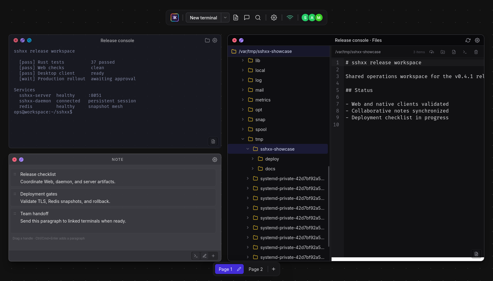
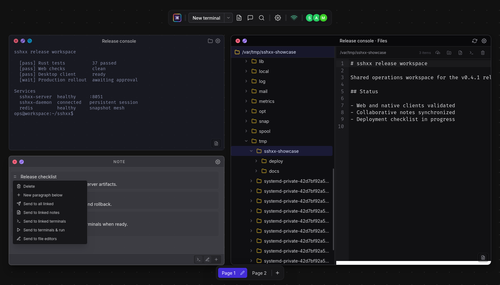

# sshxx

[English](README.md) | 简体中文

可自建的持久化协作终端：在多页面画布中组织终端、便利贴和文件窗口，通过浏览器或 Tauri 客户端访问同一个工作区；Shell 由
`sshxx-daemon` 持有，不依赖任何浏览端持续在线。



sshxx 派生自 [ekzhang/sshx](https://github.com/ekzhang/sshx)。感谢 Eric
Zhang 和所有上游贡献者完成了原始架构与实现。本仓库保留上游 Git 历史和 MIT 许可证，并针对另一套个人工作流继续扩展。

## 项目概览

| 领域             | sshxx 提供的能力                                                |
| ---------------- | --------------------------------------------------------------- |
| 持久终端         | 由 daemon 而非浏览器持有的本地与 OpenSSH Shell                  |
| 共享画布         | 携带页面标识的终端、便利贴、文件窗口、布局、关联关系和在线状态  |
| 结构化便利贴     | 支持段内换行、目标关联、拖拽复制、发送及发送后执行              |
| 终端旁的文件能力 | 同步文件夹导航、预览、CodeMirror 编辑、上传和文件操作           |
| 多种浏览端       | Web 与 Tauri 打包客户端共用同一套 Svelte 界面                   |
| 本地视图控制     | 当前页面、视口、全屏、界面模式、焦点及撤销/重做仅属于当前浏览端 |



README 只保留项目级介绍。完整功能和全量截图请查看
**[功能指南](https://github.com/glight2000/sshxx/wiki/Features)**，或从
**[sshxx Wiki 首页](https://github.com/glight2000/sshxx/wiki)** 开始阅读。

## 架构

| 组件           | 源码位置             | 职责                                              |
| -------------- | -------------------- | ------------------------------------------------- |
| `sshxx-daemon` | `crates/sshx-daemon` | 持有 Shell/SSH 进程、执行文件操作并保存持久工作区 |
| `sshxx-server` | `crates/sshx-server` | 鉴权并协调加密、页面感知的会话                    |
| `sshxx-client` | `src/`、`src-tauri/` | 通过浏览器或打包应用渲染和操作会话                |

关闭或刷新浏览端不会结束终端。daemon 重启后会恢复工作区元数据，但会重新创建 Shell 进程，不能接续之前的进程内存状态。

## 状态与信任边界

| 状态                                           | 持有者与生命周期                                     | 范围                                                   |
| ---------------------------------------------- | ---------------------------------------------------- | ------------------------------------------------------ |
| 页面、画布组件、便利贴/关联、文件浏览/编辑状态 | daemon 的 `.sshx-workspace`                          | 同一会话共享；每项画布变更都保留页面 ID                |
| Shell 与 SSH 进程                              | daemon 内存                                          | 输入输出流共享；浏览端断开后继续，daemon 重启后重建    |
| 可复用 SSH 配置                                | `.sshx-connections` 带认证加密，密钥仅本机所有者可读 | 配置元数据在会话内可见；仅写入用户可修改；从不保存密码 |
| 当前页面、各页面平移/缩放、用户设置            | 浏览器 `localStorage`                                | 仅当前浏览器配置使用，不同步                           |
| 焦点、菜单、拖拽、全屏、撤销/重做              | 浏览器内存                                           | 仅本地临时存在                                         |
| 在线用户和编辑权                               | server 内存                                          | 会话内临时状态                                         |

终端流、文件系统载荷、图片分块和活动编辑器内容加密后经 server 转发；协作所需元数据对 server 可见。拥有写入权限的参与者可以使用 daemon 或 SSH 账号所拥有的终端及文件系统权限；sshxx 不是文件系统沙箱。

除 localhost 或可信隔离局域网外，应使用 HTTPS/WSS，并将 URL Fragment 视为 Bearer
Secret。完整的持久化、同步、通信、Redis、鉴权和数据可见性约定见
**[架构与状态边界](https://github.com/glight2000/sshxx/wiki/Architecture-and-State)**。

## 开发

项目遵循仓库锁文件，并使用 `mise` 管理的运行时：

```shell
mise install
npm ci
docker compose up -d
mprocs
```

默认开发会话：

```text
http://localhost:5173/s/dev#localdevkey
```

daemon 会相对于当前工作目录保存应用数据；从同一目录启动即可恢复同一工作区。
`.sshx-workspace`、`.sshx-connections`、`.sshx-connections.key`、`cache/`
及其恢复文件都属于本地应用数据，并已明确加入 Git 忽略规则。

## 构建

```shell
cargo build --release -p sshxx-daemon -p sshxx-server
npm run build
npm run app:build
```

打包客户端还需要对应平台的 Tauri 系统依赖。Ubuntu 使用：

```shell
sudo apt-get install libwebkit2gtk-4.1-dev libayatana-appindicator3-dev librsvg2-dev patchelf
```

生产环境应在 server 前提供 TLS，使用强 secret；多 server 实例需要 Redis 参与协调。

## 文档

- [完整功能说明与全量截图](https://github.com/glight2000/sshxx/wiki/Features)
- [键盘和鼠标操作](https://github.com/glight2000/sshxx/wiki/Keyboard-and-Mouse)
- [架构、持久化、同步和安全](https://github.com/glight2000/sshxx/wiki/Architecture-and-State)
- Wiki 的版本化源文件：[`docs/wiki`](docs/wiki/Home.md)

<details>
<summary><strong>路线图与已知限制</strong></summary>

### TODO

- [ ] 在 CI 中验证带签名的桌面安装包及 Android/iOS 目标。
- [ ] 发布包含 TLS、升级、备份与恢复的长期维护生产部署参考。
- [ ] 增加版本化工作区迁移，并为页面、便利贴、吸附、搜索、终端输入和多人编辑补充端到端测试。
- [ ] 按需加载文件编辑器，缩小 Web 首屏语言注册表。
- [ ] 为 TypeAhead 隔离使用的 xterm 私有 SGR 状态增加能力检测兼容层。
- [ ] 在增加 AI
      Agent 识别或语义化完成提醒前，设计明确的 daemon-to-client 进程状态协议。

### 已知限制

- daemon 重启会恢复元数据，但会重新创建 Shell 进程。
- Windows ConPTY 当前无法报告子进程工作目录，复制终端可能回退到 daemon 目录。
- 图片粘贴目前只支持 daemon 本地 Shell；SSH 目标仍需单独的 SFTP/SCP 转发流程。
- `Shift+Enter` 发送 LF，最终是换行还是提交由前台程序决定。
- 提醒效果依赖终端 Bell 或受支持的 OSC 通知，不能推断 AI Agent 状态。
- WebGL 不可用时会回退到 DOM 终端渲染，大型终端性能会下降。
- 明文 HTTP/WebSocket 只适合可信局域网。

</details>

## 验证

```shell
cargo test --workspace --all-targets
cargo clippy --workspace --all-targets -- -D warnings
npm run lint
npm run check
npm run test:runtime
npm run build
```

## 上游与许可证

sshxx 以独立仓库发布，因此 GitHub 可能不会显示 “forked
from” 标识。需要时可以添加原项目为 `upstream` remote：

```shell
git remote add upstream https://github.com/ekzhang/sshx.git
```

sshxx 继承上游的 [MIT License](LICENSE)，并保留其原始版权与许可证声明。
